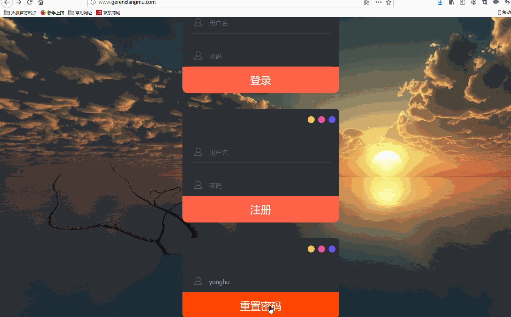

# Flask 论坛
**功能演示**

- 更改密码

- 用户信息管理

- 后台管理

- 板块发帖

- 邮件和AT功能

- 一键部署

# 论坛功能简介
- 用户模块：个人主页包括最近评论话题和最近发布话题，个人信息的管理和修改包括密码重置，上传头像，用户名等。
- 论坛模块：包括话题的编辑、评论、发布，所在版块等功能。
- 邮件和系统通知模块：包括站内信和真正收发邮件功能和@用户功能。

